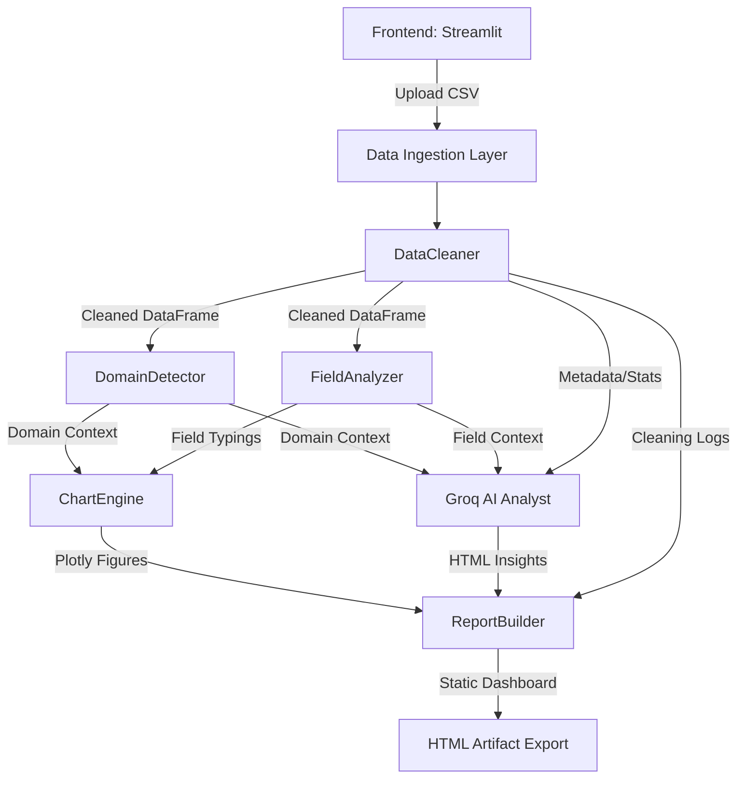

<div align="center">

# Data_Forage

[](https://www.python.org)
[](https://streamlit.io)
[](https://groq.com)
[](https://opensource.org/licenses/MIT)

</div>

Data_Forage is a production-grade, autonomous data preprocessing and analytics engine designed to transform raw, unstructured datasets into interactive, executive-ready HTML dashboards. By orchestrating a multi-agent AI pipeline utilizing Groq's high-speed inference, it eliminates the manual overhead of data cleaning, domain detection, and insight generation, enabling analysts to extract actionable intelligence from tabular data instantly.

---

## Problem Statement

Modern organizations suffer from severe data overload, consistently generating unstructured or dirty tabular datasets that languish in silos. Traditional data analysis requires hours of manual preprocessing, feature mapping, and exploratory data analysis (EDA) before any meaningful insights can be derived. Furthermore, translating these statistical findings into executive-friendly reports is a bottleneck. Data_Forage solves this by automating the entire lifecycle—from ingestion and anomaly correction to AI-assisted semantic insight extraction—reducing time-to-insight from days to mere seconds.

---

## Key Features

* **Autonomous Data Sanitization:** Dynamically infers data types, imputes missing values, and removes exact/fuzzy duplicates to ensure dataset integrity before analysis.
* **Intelligent Domain Detection:** Employs heuristic-based field mapping to classify the dataset domain (e.g., Sales, HR, Finance) and adaptively calculate context-aware KPIs.
* **High-Speed AI Insights:** Integrates Groq API (`llama-3.3-70b-versatile`) to generate executive summaries, anomaly reports, and strategic action plans based on contextual dataset metadata.
* **Conversational Analytics (RAG-inspired):** Context-aware chatbot interface allowing users to query their dataset semantics and statistical distributions in real-time.
* **Dynamic Visualization Engine:** Programmatically generates responsive Plotly charts tailored strictly to the inferred domain and underlying numeric/categorical field distributions.
* **Report Compilation:** Packages the entire analysis lifecycle—cleaning logs, KPIs, charts, and AI insights—into an interactive, zero-dependency, static HTML artifact for offline sharing.

---

## System Architecture

Data_Forage operates on a monolithic pipeline architecture designed for asynchronous processing and high-throughput data transformations. 



* **Frontend Layer:** Streamlit handles session state, file ingestion, and renders the dynamic React-based UI components.
* **Processing Core:** Pandas/NumPy driven logic for localized vectorized operations on tabular data.
* **AI/ML Layer:** Lightweight context injection to Groq's LLMs via structured prompts, avoiding the need for heavy local embeddings.
* **Visualization Layer:** Plotly Graph Objects generate vector graphics dynamically serialized to base64 or HTML strings.

---

## Tech Stack

| Category | Technology | Rationale |
| :--- | :--- | :--- |
| **Frontend** | Streamlit | Rapid prototyping of data-heavy UIs with native session state management. |
| **Backend Core** | Python 3.11, Pandas | Industry standard for vectorized, memory-efficient tabular data manipulation. |
| **Visualization** | Plotly | Interactive, high-performance web-gl graphics with native HTML serialization. |
| **AI/ML** | Groq SDK, Llama-3 | Groq's LPU architecture provides sub-second TTFT (Time To First Token) for real-time analysis. |
| **Environment** | Python `python-dotenv` | Secure, isolated management of API keys and configuration secrets. |

---

## Data Pipeline

1. **Data Ingestion:** Uploads are streamed into memory. Fallback encoding decoders (UTF-8 to Latin-1) handle legacy CSV structures.
2. **Preprocessing:** 
   - `DataCleaner` applies type casting.
   - Null values are handled via median imputation (numeric) or mode replacement (categorical).
   - High-variance categorical anomalies are normalized.
3. **Domain Inference:** 
   - `DomainDetector` scores column semantics against predefined taxonomies (e.g., `revenue` + `date` triggers the Sales domain).
4. **Field Mapping:** 
   - `FieldAnalyzer` segregates the cleaned dataframe into `numeric`, `categorical`, and `datetime` clusters.
5. **Chart Generation:** 
   - `ChartEngine` evaluates field availability against domain requirements to dynamically build correlation matrices, distributions, and trend lines.
6. **Insight Generation:** 
   - Dataset metadata (schema, descriptive stats, KPIs) is structured into an LLM prompt for Groq to return actionable HTML summaries.
7. **Export Construction:** 
   - `ReportBuilder` injects all visual and textual components into a dark-themed CSS/HTML template.

---

## AI/ML Logic

Because Data_Forage operates on tabular data rather than unstructured text, it utilizes a **Metadata-Injection** strategy rather than traditional RAG (Retrieval-Augmented Generation). 

* **Context Window Optimization:** Instead of passing the entire dataframe (which exceeds token limits and risks PII exposure), the system computes `df.describe()`, extracts exact column schema, and computes domain-specific KPIs.
* **Prompt Engineering:** The LLM is instructed via strict system prompts to act as a Senior Data Analyst. It is forced to return raw, style-free HTML structure (`<h3>`, `<ul>`, etc.) to map cleanly into the UI's existing DOM constraints.
* **Conversational Memory:** Chat history is maintained in the Streamlit session state and appended to the Groq payload to enable multi-turn contextual queries regarding the dataset's statistical profile.

---

## Project Structure

```text
data_forage/
├── app.py                  # Main Streamlit application and UI orchestrator
├── .env.example            # Environment variable templates
├── core/
│   ├── ai_analyst.py       # Groq API integration and prompt engineering
│   ├── chart_engine.py     # Dynamic Plotly figure generation logic
│   ├── data_cleaner.py     # Vectorized data sanitization pipeline
│   ├── domain_detector.py  # Heuristic scoring for dataset classification
│   ├── field_analyzer.py   # Type inference and schema mapping
│   └── report_builder.py   # HTML string templating and compilation
└── requirements.txt        # Exact dependency pinning
```

---

## API Endpoints

*Note: Data_Forage currently operates as a stateful Streamlit application. However, the core logic is decoupled. If exposed via FastAPI, the primary analysis route would resemble:*

**`POST /api/v1/analyze`**
* **Purpose:** Process a raw CSV and return JSON metadata and HTML report.
* **Request:** `multipart/form-data` containing `file: data.csv`
* **Response Example:**
```json
{
  "status": "success",
  "domain": "Sales",
  "confidence": 85.5,
  "kpis": {
    "Total Revenue": "$1,450,230",
    "Avg Order": "$124.50"
  },
  "report_url": "https://storage.local/reports/sales_report_123.html"
}
```

---

## Installation & Setup

### Prerequisites
- Python 3.11+
- A valid Groq API Key

### Local Development

1. **Clone the repository:**
```bash
git clone https://github.com/yourusername/data_forage.git
cd data_forage
```

2. **Establish Virtual Environment:**
```bash
python -m venv venv
source venv/bin/activate  # On Windows use: venv\Scripts\activate
```

3. **Install Dependencies:**
```bash
pip install -r requirements.txt
```

4. **Environment Configuration:**
```bash
cp .env.example .env
# Edit .env and insert your GROQ_API_KEY
```

5. **Run the Application:**
```bash
streamlit run app.py
```

---

## Environment Variables

Create a `.env` file at the root of the project.

```env
# Groq Inference API Key
# Required for generating AI insights and conversational analytics.
# Get a free key at: https://console.groq.com/keys
GROQ_API_KEY=gsk_your_api_key_here

# (Optional) Disable Streamlit Telemetry
STREAMLIT_GATHER_USAGE_STATS=false
```

---

## Screenshots / Demo Section


*Dynamic Dark-Mode Dashboard with KPI Grid and Plotly Analytics*


*Executive Insights Generated by Llama-3*

---

## Challenges Faced

1. **Token Limits vs. Tabular Complexity:** Injecting tabular data into an LLM is inherently inefficient. Passing thousands of rows exceeds context windows. *Solution:* Engineered a pipeline that extracts descriptive statistics, variance thresholds, and schema definitions, providing the LLM with the "shape" of the data rather than the raw rows.
2. **Dynamic Chart Rendering UI Blocking:** Rendering 12+ Plotly charts synchronously blocked the Streamlit main thread, causing perceived latency. *Solution:* Leveraged cached decorators and optimized the `ChartEngine` to pre-compile figures in memory before DOM injection.
3. **HTML Artifact Styling:** Exporting Plotly charts alongside custom AI HTML output into a single, offline, zero-dependency HTML file required meticulous inline CSS templating to ensure it looked professional without external stylesheets.

---

## Design Decisions & Trade-offs

* **Streamlit vs. React/FastAPI:** Streamlit was chosen for its unparalleled speed in building data-first applications. While it limits fine-grained DOM manipulation (necessitating hacky CSS injection for the dark theme), it reduced the boilerplate required for file handling and reactive UI updates by 80%.
* **Groq vs. OpenAI:** Groq was selected strictly for latency. Executive dashboards require real-time interactions. Waiting 10 seconds for GPT-4 to stream insights ruins UX. Groq's LPU delivers the entire Llama-3 response in under a second.
* **No Vector DB:** Because the platform analyzes *structured tabular data* rather than unstructured text blobs, semantic RAG utilizing Pinecone/Chroma was deemed architectural overkill. Metadata injection proved vastly superior for precision tabular analytics.

---

## Performance & Scalability

* **In-Memory Constraints:** Currently, `pandas.read_csv` loads data fully into RAM. For a Streamlit app on standard hardware, datasets > 500MB will cause memory thrashing.
* **Optimization Path:** Future iterations will replace Pandas with **Polars** to leverage lazy evaluation and multi-threaded execution, pushing the single-node limit into the gigabyte range.
* **LLM Caching:** Prompts mapped strictly to dataset hashes ensure identical datasets do not burn redundant API calls.

---

## Security Considerations

* **Data Privacy:** Raw dataset rows are *never* transmitted to external APIs. Only aggregated statistics (`df.describe()`), column names, and calculated KPIs leave the local server boundary.
* **Sanitization:** The `AIAnalyst.clean_ai_html()` method aggressively strips `<script>`, `<style>`, and stray Markdown artifacts from LLM outputs to prevent XSS vulnerabilities upon rendering inside the UI or exported HTML reports.

---

## Future Improvements

* **Polars Migration:** Swap Pandas out for Polars to achieve 10x faster vectorized cleaning operations.
* **Multi-Modal Support:** Add PDF parsing capabilities to allow joining unstructured text data with tabular operational data.
* **Headless API Mode:** Decouple the UI completely and expose the `DataCleaner` and `ReportBuilder` via a FastAPI REST interface for CI/CD pipeline integration.
* **Distributed Processing:** Implement Celery/Redis workers to handle massive file uploads asynchronously without blocking the WSGI thread.

---

## Deployment

For production deployments, Docker is recommended:

```dockerfile
FROM python:3.11-slim
WORKDIR /app
COPY requirements.txt .
RUN pip install --no-cache-dir -r requirements.txt
COPY . .
EXPOSE 8501
CMD ["streamlit", "run", "app.py", "--server.port=8501", "--server.address=0.0.0.0"]
```

Easily deployable to **Render** or **Railway** by attaching the GitHub repository and injecting the `GROQ_API_KEY` into the platform's secret manager.

---

## License

This project is licensed under the MIT License - see the LICENSE file for details.

---

## Author

**Data Engineer / AI Developer**
* **GitHub:** [your-github-username](https://github.com/)
* **LinkedIn:** [your-linkedin-profile](https://linkedin.com/)
* **Portfolio:** [your-portfolio.dev](https://example.com)
* **Contact:** [your.email@example.com](mailto:test@example.com)
